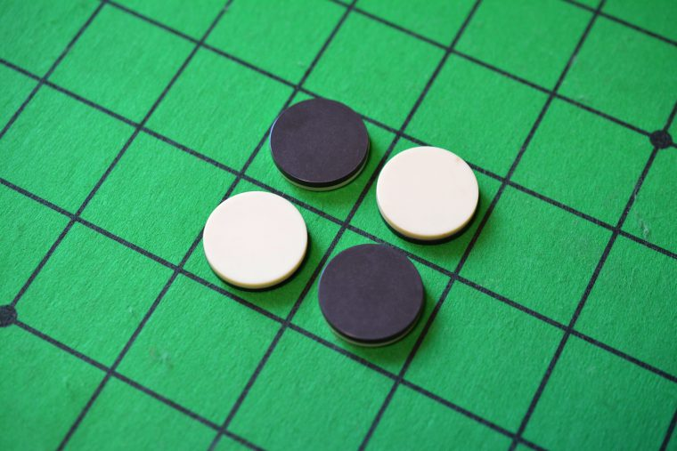

# reversi

Example Reversi smart contract written in ink! (Rust eDSL).

Board size is adjustable between 6x6 to 10x10.
Black disks for player1, white ones for player2. The game always start from player1's turn as of now.

